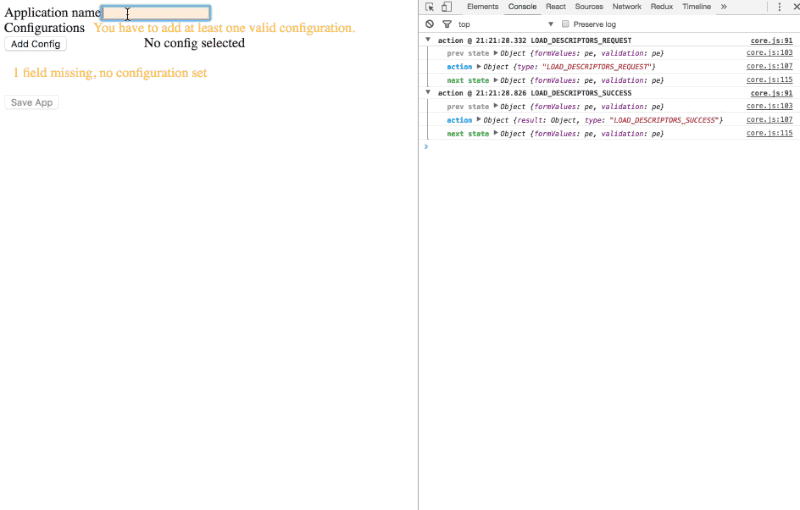

# Complex forms validation using reselect

There are many [validation libraries](https://react.rocks/tag/Validation) out there. Unfortunately, most of them are limited, or in a worse case, limit you. They work great for To-Do/Login/Sign up forms, but fail for anything a little bit more convoluted.

For complex forms and dynamic validation rules, we can use what a lot of us already have in stack: [reselect library](https://github.com/reactjs/reselect).

## Requirements
There are different requirements for validation functionality, based on what UX team comes up with, or what is possible technically. You can’t get away only with To-Do list scenarios in real dev life.

**Visual / functional requirements:**
- Form can be pre-validated, just after it renders
- Form can be validated on field’s focus/keypress/blur
- Each field can have specific visual treatment (message, colors, icons...)
- Dynamic validation rules (some fields validate in one use case, different fields validate in another use case)
- Support for async validation (email taken, additional form fields loaded?)
- Support for i18n

**Code preference and organization:**
- Minimal markup changes, I want nice and readable forms JSX (no custom elements, no wrappers, extra attributes...)
- Form can be reused in another place, with different validation rules
- Validation logic can be centralized in one place (simple forms, form leafs…), or distributed to several places (custom UI controls, common rules…)
- Easy integration into existing react apps
- I don’t want to change existing reducers (or action creators) to perform the validation
- Validation logic can be customized on runtime
- Separation of validation logic and form decoration (easier testing and better reusability)
- I can compose different validations, in similar way I can combine forms partials together
- I can test validation logic

## Reselect to rescue
All the validation complexity lays in two areas: reducers and selectors.

When user interacts with the app, he triggers actions which lead to state modification through reducers. After reducers are done with their updates, different containers would rerender, based on what part of state are connected to given container using selectors. This is nothing new for you, if you use react/redux/reselect setup.

The validation design I use doesn’t add anything new to that flow. It just uses it’s power and extends usage of reselect.

### How it works
Validation reuses already existing selectors, usually required for rendering or computation purposes.

```javascript
// selectors that could be used by app as well (probably defined in different files)
const getTracks = state => state.albums;
const getCurrentAlbum = state => state.selectedAlbumId;

export const getTracksOfAlbum = createSelector(
  [getTracks, getCurrentAlbum],
  (tracks, albumId) => {
    return tracks.filter(track => track.get('albumId') === albumId);
  }
);
```

In addition, there are selectors dedicated to validation and decoration. I like to keep those two areas separate for several reasons. Validation selectors are responsible only for checking if something is, or is not valid. They provide a set of flags, counters or mappings. In some cases, it is better to have granularity, other times you want a single selector, that returns combination of those flags and counters (I call these validation reports).

```javascript
// selectors/validation.album.js
import { getTracksOfAlbum } from './album';

export const hasAnyTracksSelector = createSelector(
  [getTracksOfAlbum],
  (tracksOfAlbum) => {
    return (tracksOfAlbum.size > 0);
  }
);
```
Decorations use validation selectors and reports, and build visual alterations and text messages on top of it.

This separation allows better reusability - different decorators can depend on same validators (as you can also see in the example app on the footer message decorator). You can also create a library of common validators or decorators, and test these separately.

```javascript
// selectors/decoration.album.js
import { hasAnyTracksSelector } from './decoration.album';

export const albumDecorationSelector = createSelector(
  [hasAnyTracksSelector],
  (anyTracks) => {
    return {
      message: anyTracks ? '' : 'You have to add at least one track.',
      classes: anyTracks ? '' : 'empty missing'
    };
  }
);
```

If some validation is more complex and needs to work with it’s own state, you can provide dedicated reducer and keep your original reducers intact, or with minimal changes (see owner user validation in the example app). That way, you don’t have to change tests for existing reducers and you can fine tune validation much easier.

```javascript
export const albumValidation = (state = initialState, action) => {
  switch (action.type) {

    case types.ALBUM_YEAR_VERIFY_SUCCESS:
      return state.
        set('albumVerificationProgress', false).
        set('verifiedAlbums', albums => albums.push(action.albumId)).
        set('isAlbumYearCorrect', true);

    default:
      return state;
  }
};

// then a dedicated validation selector
export const isAlbumValidSelector = state => state.isAlbumYearCorrect;
```

Changes in markup are minimal and mostly consist of adding class names, flag based conditional rendering or messages. I consider these to be much less drastic than adding custom attributes, wrappers or rewriting DOM API using custom elements.

Also, if you ever need to change component into container, or vice versa, you should not need to worry about validation, since it is just passed in through props.

## Example app
Details of the app and some mockups are described in this [Medium post](https://medium.com/@roman.damborsky/using-reselect-for-advanced-validation-in-redux-apps-60a686fde088). Running version of the example is at [validation-reselect.herokuapp.com](https://validation-reselect.herokuapp.com/).



## Q/A
Some questions you might ask, or thoughts about how to implement some of the use cases from requirements above. If you have an idea how to do these things better, or if there is something that you think would not work, I'll be happy to hear.

### Q: Why reselect?
Selectors in general are great way to get your data prepared for containers and components. We use selectors a lot and it makes a big difference, if compared to a project without it. Everything is more readable, easier to test and follow.

Because validation depends on what you have in your state, selectors are logical choice. You can reuse a lot of code that's already there, and the validation is only extending it.

And then comes the benefits of reselect itself - memoization - to name the most important one. If your selectors for validation and decoration reuse some sets of selectors over and over, memoization is great to have. This also pays of when you use one validation report for several different decorations (eg. a missing field disables submit button, shows warning message on top of the page and highlights something in parent component - all at the same time). Because validation report result is memoized and you can build several decoration selectors on top of it, you can then use these decoration selectors in various containers.

### Q: How do I validate field only on blur?
One of the ways is to use dedicated reducer for validation and have something like `visitedFields`, where you add name of the field which user just left (by triggering onBlur action). Then, you can check whether particular field is on this list and add decoration based on that.

### Q: How do I validate only at a certain point, like clicking Submit button?
Using dedicated reducer, you can have a property `shouldValidate` on its state, with `false` as default. If user clicks the button, or the action to run validation happens, you set that flag to true. In selectors, you would add a condition to return decorations only in a case when `shouldValidate` is true. From that point on, validation would be dynamic.

If you want to validate again only on that same condition, you would probably have to trigger the validation, and after that trigger an action that resets `shouldValidate` field. I believe this could be done with [redux-thunk](https://github.com/gaearon/redux-thunk) or [redux-batched-actions](https://github.com/tshelburne/redux-batched-actions). (verification and feedback appreciated)

### Q: How do I treat different validation states of fields?
You can use decoration selectors. Each decoration selector (or a single decoration report selector) could provide different set of css classnames, messages or flags, that you can use in render method of your container/component.

```javascript
export const getDecoration = createSelector(
  [hasAtLeastOneTrackSelector, isTutorialModeSelector],
  (atLeastOneTrack, isTutorialMode) => {
    return {
      fieldClasses: atLeastOneTrack ? 'optional' : 'required',
      titleMessage: atLeastOneTrack ? 'Record includes' : 'It is a blank vinyl',
      showMissingIcon: !atLeastOneTrack,
      shouldRenderHowToModal: isTutorialMode && !atLeastOneTrack
    };
  }
);
```

### Q: How do I alter validation functionality dynamically?
You can set different stages of validation in dedicated validation reducer. It can also contain additional details required for validation logic determination. Since you can update state of a reducer for any action triggered in the app, you can set those flags when data loading finishes, some value is selected in form, certain fields are filled in, etc.

Once you get that information in reducer, it's easy to get it out using selectors again. Your validation/decoration selectors could use selectors based on this reducer as a dependency, and alter their results based on it.

In this example, the assumption is that both CD and Vinyl validations can actually happen. I expect that shape of state won't change with different form inputs. As long as selectors don't run into exceptions and always return at least some value, it doesn't matter much if we throw away the validation report that we don't need.

If you have any comments or suggestions how to do this better, let me know. I'm not very happy with this part.

```javascript
// either validate CD or Vinyl details of a record
const mediumTypeSelector = state => state.get('mediumType');

const getCDValidationReport = createSelector(
  [mediumTypeSelector, isCDTextValidSelector],
  (mediumType, isCDTextValid) => {
    if (mediumType !== 'cd') {
      return null;
    }
    // prepare validation report
  }
);

const getVinylValidationReport = createSelector(
  [mediumTypeSelector, isRPMValidSelector],
  (mediumType, isRPMValid) => {
    if (mediumType !== 'vinyl') {
      return null;
    }
    // prepare validation report
  }
);

export const getValidation = createSelector(
  [getCDValidationReport, getVinylValidationReport],
  (cdValidationReport, vinylValidationReport) => {
    return cdValidationReport || vinylValidationReport
  }
);

```

### How do I do async validation?
Use dedicated validation reducer and set bunch of flags there, to see what's the state of async request. Then, trigger the async action in response to desired event (click, focus, keypress...) Once you have couple of flags and result handled in the reducer, it's easy to get it out.

Because we don't have chained actions in default redux, you cannot trigger field change and validation request at the same time. So you might need to adjust your existing reducers. For example, if you hook up email validation to input field keypress, you would have to change the action type that is triggered from let's say `EMAIL_CHANGED` to `EMAIL_VALIDATION_REQUEST`. Then you need to handle this action in all reducers. You can find this in example app in [form reducer](https://github.com/rdamborsky/validation-reselect/blob/master/src/reducers/formValues.js#L61), [validation reducer](https://github.com/rdamborsky/validation-reselect/blob/master/src/reducers/validation.js) and in [actions](https://github.com/rdamborsky/validation-reselect/blob/master/src/actions.js#L75). (The other way around - changing from EMAIL_VALIDATION_REQUEST to EMAIL_CHANGED in async action is also possible. It depends on your taste and setup)

You might find a way around this with [redux-thunk](https://github.com/gaearon/redux-thunk) or [redux-batched-actions](https://github.com/tshelburne/redux-batched-actions). (verification and feedback appreciated)

### How do I test validation and decoration?
Both validation and decoration logic are represented by reselect selectors (or simple pure functions). And it is fairly easy to test selectors (see [reselect docs](https://github.com/reactjs/reselect#q-how-do-i-test-a-selector)).
It is also easy to test reducers, if you have those for validation purposes.

### I18n support?
Selectors could import your language bundles or string maps and use it. If you have current locale info in state, you're good to go. Since selectors can accept props of container that calls it, you can also access I18n data from container, in case you pass them that way.

## Feedback

I'd be happy to hear back from you. If you have any questions, suggestions or you have some validation use case I didn't cover, please, [report an Issue](https://github.com/rdamborsky/validation-reselect/issues) or add a comment to source.

I'm still experimenting with this and figuring out how to improve it. For example:

- how do you name selectors? Some of them return immutable object, some of them plain js. Do you have any conventions on this?
- I'm not using immutable.js in the most effective way and converting everything to js objects in containers. The reason is that I prefer simple dot notation API instead of getters. And we had no performance issues so far, so no need to worry about that until they pop up. What are other implications I overlooked?
- Same with selectors - could be written in more efficient manner. I'm learning how to work with parameters and dynamic selectors.
